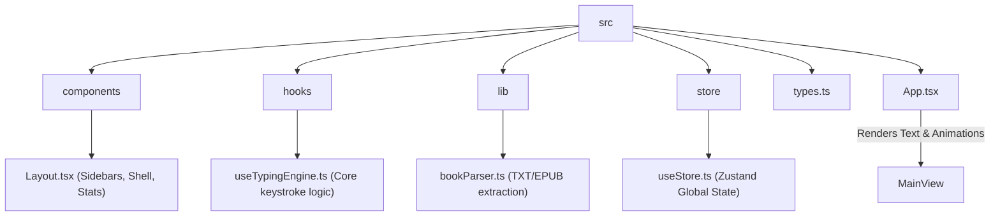
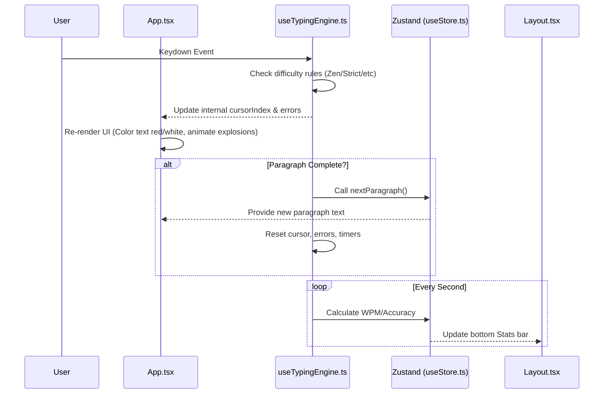

# TypeBook Architecture & Documentation

Welcome to the TypeBook documentation. This document is designed to give you a rapid, high-level understanding of how the application is built so you can easily modify and extend it.

## Philosophy

TypeBook is built to be a fast, distraction-free, gamified reading experience. It focuses on taking standard public domain text files (`.txt`, `.epub`) and breaking them down into an interactive typing/reading session.

**Core principles:**
- **Zero-to-One Gamification:** Typing shouldn't be boring. Themes should break the mold (e.g., words physically exploding off the screen when completed).
- **Responsive State:** The app remembers where you left off. State is persisted to `localStorage` automatically.
- **Progressive Difficulty:** Not everyone wants to type perfectly. Some just want to press the spacebar to read (Zen Mode).

---

## File Structure

Here is a quick overview of the file tree and what each directory is responsible for:

### Directory Breakdown

- **`src/types.ts`**: The single source of truth for TypeScript interfaces (Books, Chapters, State, Settings).
- **`src/store/useStore.ts`**: We use [Zustand](https://github.com/pmndrs/zustand) for global state. It handles the user's progress (`bookId`, `chapterIndex`, `paragraphIndex`), their settings, and library. It automatically persists state to `localStorage`.
- **`src/components/Layout.tsx`**: The UI shell. It contains the left sidebar (Library & Chapters), the right sidebar (Settings & Themes), and the floating bottom stats bar (WPM/Acc).
- **`src/App.tsx`**: The main view area. It fetches the current paragraph from the store, runs the typing engine, and uses `framer-motion` to render the words and the explosive animations.
- **`src/hooks/useTypingEngine.ts`**: **The Engine Room**. This file intercepts every keystroke from the user and decides what to do based on the difficulty setting (`zen`, `lazy`, `normal`, `strict`).
- **`src/lib/bookParser.ts`**: Handles reading raw text files or fetching the pre-loaded books from the `/public` directory, chunking them into readable chapters and paragraphs.

---

## Data Flow: How Typing Works

When a user presses a key, here is the flow of data:

## How to make changes

1. **Want to add a new difficulty mode?**
   - Open `src/types.ts` and add it to the `Difficulty` union.
   - Open `src/components/Layout.tsx` and add a new Radio button for it.
   - Open `src/hooks/useTypingEngine.ts` and add an `if (settings.difficulty === 'new_mode')` block in `handleKeyDown`.

2. **Want to add a new Theme/Animation?**
   - Open `src/types.ts` and add it to the `Theme` union.
   - Open `src/components/Layout.tsx` and add a new Button in the Right Sidebar.
   - Open `src/App.tsx` and locate the `<motion.span>` components inside `renderParagraph()`. Add a new `animate={}` variant matching your theme.

3. **Want to improve EPUB/PDF parsing?**
   - Head straight to `src/lib/bookParser.ts`. The UI simply waits for an array of `Chapter` objects containing `paragraphs: string[]`. As long as your parser returns that format, the rest of the app will work flawlessly.
